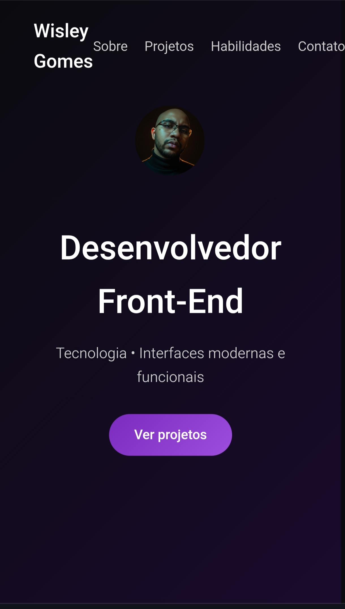

# 🌐 Portfólio — Wisley Gomes

  

Portfólio pessoal desenvolvido para apresentar meus projetos, habilidades e trajetória na área de desenvolvimento front-end, unindo tecnologia, dedicação e foco em usabilidade.

## 🚀 Tecnologias Utilizadas

- HTML5
- CSS3 (Flexbox, Grid, animações)
- JavaScript (interações e animações com Intersection Observer)
- Git & GitHub

## 🎨 Identidade Visual

- Tema escuro (preto + roxo)
- Estética moderna e tecnológica
- Animações suaves para melhor experiência do usuário

## 📂 Seções do Site

- Apresentação (Hero)
- Sobre mim
- Projetos
- Habilidades
- Contato

## 🧠 Diferencial

Experiência na área da saúde (Enfermagem) aplicada à tecnologia, com foco em acessibilidade, UX e soluções digitais voltadas para pessoas.

## 🔗 Acesse o projeto

👉 [Portfólio Online](https://wisleygomes.github.io/port-wisley)

## 📬 Contato

- GitHub: https://github.com/wisleygomes
- LinkedIn: (https://www.linkedin.com/in/wisley-gomes-710537359/)
